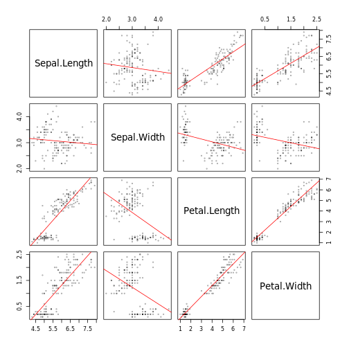

## What is RMarkdown?

Rmarkdown is a variant of markdown that makes it easy to incorporate R code into your documents. This allows you to do neat things like generating plots and summarizing your data right in your document. Among other benefits, it means that you don't need to rewrite your document if you get more data.

## The `iris` Dataset

This dataset is a collection flower morphology measurements taken from three species of iris collected by Edgar Anderson. This dataset also has the benefit of being included in base R, which is nice.


*Image shamelessly taken from DataCamp's [Machine Learning in R for Beginners](https://www.datacamp.com/community/tutorials/machine-learning-in-r)*

### Getting a Sense of the Data

The first thing to do with any new data set is to double check the variables. To do this without flooding your console, try the `head()` command.


```
##   Sepal.Length Sepal.Width Petal.Length Petal.Width Species
## 1          5.1         3.5          1.4         0.2  setosa
## 2          4.9         3.0          1.4         0.2  setosa
## 3          4.7         3.2          1.3         0.2  setosa
## 4          4.6         3.1          1.5         0.2  setosa
## 5          5.0         3.6          1.4         0.2  setosa
## 6          5.4         3.9          1.7         0.4  setosa
```

Want to know the dimmensions of the dataset? Try `dim()`


```
## [1] 150   5
```
*Note that the first output is the number of rows, second is columns.*

Unclear on what type of data you're looking at? Try the `str()` command.


```
## 'data.frame':	150 obs. of  5 variables:
##  $ Sepal.Length: num  5.1 4.9 4.7 4.6 5 5.4 4.6 5 4.4 4.9 ...
##  $ Sepal.Width : num  3.5 3 3.2 3.1 3.6 3.9 3.4 3.4 2.9 3.1 ...
##  $ Petal.Length: num  1.4 1.4 1.3 1.5 1.4 1.7 1.4 1.5 1.4 1.5 ...
##  $ Petal.Width : num  0.2 0.2 0.2 0.2 0.2 0.4 0.3 0.2 0.2 0.1 ...
##  $ Species     : Factor w/ 3 levels "setosa","versicolor",..: 1 1 1 1 1 1 1 1 1 1 ...
```


### Looking for Distributions and Patterns

Now let's how the data are distributed. The `summary()` command will calculate some simple summary stats for each column. 


```
##   Sepal.Length    Sepal.Width     Petal.Length    Petal.Width   
##  Min.   :4.300   Min.   :2.000   Min.   :1.000   Min.   :0.100  
##  1st Qu.:5.100   1st Qu.:2.800   1st Qu.:1.600   1st Qu.:0.300  
##  Median :5.800   Median :3.000   Median :4.350   Median :1.300  
##  Mean   :5.843   Mean   :3.057   Mean   :3.758   Mean   :1.199  
##  3rd Qu.:6.400   3rd Qu.:3.300   3rd Qu.:5.100   3rd Qu.:1.800  
##  Max.   :7.900   Max.   :4.400   Max.   :6.900   Max.   :2.500  
##        Species  
##  setosa    :50  
##  versicolor:50  
##  virginica :50  
##                 
##                 
## 
```

One simple way to look for covariation between numerical data is to plot them using a scatter plot. The `pairs()` function lets you plot all variables in a dataset against each other in this way.


But this gets messy quickly, so let's clean it up.



While there are a few strong trends, it seems the data are confounded by the only non-numeric variable, `Species`. Let's use `ggplot2` to look at how species affects the correlation between one of these pairs of floral traits.


